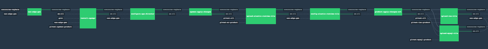
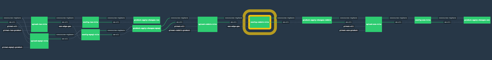

## Pipeline 'Environment Pre-Reqs'

- vSphere 6.x or greater functional environment
- NSX-V must be deployed and functional on one or more vSphere cluster(s)
- NSX-V must have the following constructs created:

	- Cluster(s) must have VXLAN(vTEPS) prepared & functional 
	- A NSX Transport Zone can already exist or would be created (requires the cluster names)
- vSphere environment must have at least **1** of the following ***[Standard PortGroup|Distributed PortGroup|Logical Switch]*** for an `uplink` port group.  
   - This port group must have a network that is routable in the environment.  This is the `uplink` network
- vSphere environment must have at least **1** of the following ***[Distributed PortGroup]*** for an `uplink` port group, required for DLR uplink (as transit network between the deployed esg and the dlr) if DLR option is enabled. 
   - This port group must have a network that is routable in the environment.  This is the `uplink` network
- vSphere Environment must have **5** routable ip addresses on the `uplink` network for NSX Edge Load Balancer VIPs & NAT configuration.
    - NSX Edge Primary Uplink Interface IP (Default SNAT)
    - DNAT _VIP-Opsman_
    - Load Balancer _VIP-ERT_ (Go Routers)
    - Load Balancer _VIP-SSH-Proxy_ (Diego Brains)
    - Load Balancer _VIP-TCP-ROUTER(s)_
    - any additional IPs for exposed isolation segements
- DNS must resolve mapped to the following VIPs
    - **opsman.[your-system.cf.domain]** -> _VIP-Opsman_
    - ***.[your-system.cf.domain]** -> _VIP-ERT_
    - ***.[uaa.your-system.cf.domain]** -> _VIP-ERT_
    - ***.[login.your-system.cf.domain]** -> _VIP-ERT_    
    - ***.[your-default-apps.cf.domain]** -> _VIP-ERT_
    - **ssh.[your-system.cf.domain]** -> _VIP-SSH-PROXY_
    Additional entries for each isolation segment added.
    Note: system.cf.domain, default-apps.cf.domain would be subdomain under cf.domain
- All desired vSphere Datacenter,Cluster,& Resource Pool objects must exist.  The pipeline will not create them.
- vCenter Account must have proper permissions.

## Support for PCF 1.11 integration with NSX and C2C
Modify the pivnet resources to refer to '1\.11\..*' version for the ops man, ert, iso and other tiles to use the PCF 1.11 version that has integration with NSX Security Groups and LBR features along with Container to Container networking. For PCF 1.10 or older versions, the jobs (like gorouter) would use static ip based membership unlike the dynamic security group based membership in PCF1.11. 

Note: The BOSH and Ops Mgr 1.11 integration requires the NSX Manager to present a self-signed or appropriate CA signed cert that matches the hostname specified for the NSX Manager.
Ops Mgr would report failures in validation of the cert if:
1) fully qualified hostname is specified for NSX Manager but the cert only contains just the hostname.
2) IP is specified for NSX but cert presents hostname (partial or fully qualified)
3) Just hostname specified that matches the cert but the address resolution would fail without full qualification.

Recommendation is to ensure the NSX Manager has a cert that specifies the fully qualified hostname or has a subjectAltName (SAN) field with IP address or host that matches the provided NSX Manager (instead of only fully qualified host name).

Video Link(s)

- PCF-NSX Demo (March 20, 2017): [stream-video](http://pcf-bt-vmware.s3-us-west-2.amazonaws.com/btvid.html) or [download-video](http://pcf-bt-vmware.s3-us-west-2.amazonaws.com/pcf-nsx-demo.mp4) (800MB | 24:44)


## Running the Pipeline

1. Clone this repo: `git clone https://github.com/cf-platform-eng/nsx-ci-pipeline.git`
2. Change into the resultant directory: `cd nsx-ci-pipeline`
3. Create a directory for you Concourse parameters|configuration file: `mkdir params`
4. Past parameters the sample below into a new file,  ***change the required min variables!!!*** : `vi params/env1-params.yml`

## Validation of settings using `nsx-edge-gen`
1. Get a copy of the [nsx-edge-gen](https://github.com/cf-platform-eng/nsx-ci-pipeline.git) repo.

   Ensure the requirements are met (python, pip install of the requirements specified in the nsx-edge-gen README).  
2. Edit the sample script under `test/run-test.sh` with the relevant parameters
3. Run the script without any args, so the default 'list' operation is invoked ( using `<path>/run-test.sh`) - this would test basic connectivity and show a description of configuration that would be used for any creation.
4. If there are any errors, correct them (possibly creds, endpoints etc)
5. Try to create a nsx edge instance using `<path>/run-test.sh build`
6. Ensure the creation succeeds against the vSphere env. Fix any errors as needed (like name of resources, certs, other settings)
7. Destroy the edge instance using `<path>/run-test.sh destroy`
7. Tweak options as necessary and run create/destroy
8. Then apply any changes to the main params file for the nsx-ci-pipeline and start the pipeline.

## Installing additional Isolation Segments
Use the add-additional-iso-segment pipeline and provide the params as specified in the sample template (without indexes) while modifying the network, replicator name, segment names.. and then run the pipeline for each additional iso-segment. The network should have already been created using nsx-edge-gen (following the ISOZONE-0* marker). Atmost 3 iso segments are supported.
Any additional segments would require extending the nsx-edge-list and nsx-edge-gen tasks along with the pipeline constructs.

**To use this pipeline to create the env1-params.yml file with the following sample.  Replace all variables commented as `REQUIRED`!!!**

```
#########################
## ERT & Opsman config ##
#########################
---
# Core Concourse Resource Params
pivnet_token: <YOUR PIVNET TOKEN> #REQUIRED
github_user: <YOUR GITHIB USERID> #REQUIRED
github_token: <YOUR GITHIB TOKEN> #REQUIRED

# Pivnet Tile versions
opsman_product_version: '1\.11\.*'      # Change to '1\.10\.*' for Ops Mgr 1.10 or other versions
ert_product_version: '1\.11\.*'
iso_product_version: '1\.11\.*'
mysql_product_version: '1\.8\.*'
rabbit_product_version: '1\.7\.*'
scs_product_version: '1\.4\.*'

## vCenter Params
vcenter_host: <YOUR VCENTER URL|IP> #REQUIRED
vcenter_usr: administrator@vsphere.local #REQUIRED
vcenter_pwd: <YOUR VCENTER ADMIN PASSWD> #REQUIRED
vcenter_data_center: Datacenter #REQUIRED

## NSX Integration Params
nsx_edge_gen_nsx_manager_address: <YOUR NSX MANAGER IP> #REQUIRED
nsx_edge_gen_nsx_manager_fqdn: <YOUR NSX MANAGER HOSTNAME with FQDN> #REQUIRED
nsx_edge_gen_nsx_manager_admin_user: admin #REQUIRED
nsx_edge_gen_nsx_manager_admin_passwd: <YOUR NSX MANAGER PASSWORD> #REQUIRED
nsx_edge_gen_nsx_manager_transport_zone: <YOUR NSX TRANSPORT ZONE> #REQUIRED
nsx_edge_gen_nsx_manager_transport_zone_clusters: #Can be Empty; REQUIRED if Transport Zone does not exist and needs to be created. example:"Cluster1,Cluster2"

nsx_edge_gen_nsx_manager_distributed_portgroup: YOUR NSX DISTRIBUTED PORTGROUP #REQUIRED - used for DLR uplink, as transit network between the deployed esg and the dlr
nsx_edge_gen_egde_datastore: <YOUR DATASTORE FOR NSX EDGES> #REQUIRED example: vsanDatastore
nsx_edge_gen_egde_cluster: <YOUR CLUSTER FOR NSX EDGES> #REQUIRED example: Cluster1

# Unique identifier and under `15 charactes` in length.
nsx_edge_gen_name: nsx-pipeline1 #string name for NSX objects

## To enable or disable DLR in the NSX Edge config
## valid values: (true|false) 
nsx_edge_gen_enable_dlr: false # REQUIRED


## Indicate if BOSH & PCF has nsx integration
## valid values: (true|false) 
## For PCF versions 1.11 or newer, set to true
## For PCF versions 1.10 or older, set to false
## This flag allows nsx-edge-gen to populate the pool with static member ips (if false)
## and avoid populating it (if true) as Bosh would use security groups to associate pool with job members
nsx_edge_gen_bosh_nsx_enabled: true # REQUIRED -> true for PCF 1.11+, false for PCF 1.10 or older

# Set to true (default) if ssl should be terminated by LBR 
# and only unencrypted traffic forwarded to GoRouter
# Set to false if encypted traffic should be forwarded as pass-through by LBR 
# and ssl needs to be terminated only at GoRouter
esg_go_router_ssl_term_1: true 

esg_size: compact # valid values (compact|large|xlarge|quadlarge)
esg_ospf_password_1: P1v0t4l
esg_cli_username_1: admin 
esg_cli_password_1: P1v0t4l!P1v0t4l!

## Certs for generation
ert_certs_name_1: nsx-gen-created # EDIT
ert_certs_ou: Pivotal             # EDIT
ert_certs_country: US             # EDIT

esg_default_uplink_pg_1: "<YOUR NSX-EDGE-UPLINK PORT GROUP>" #REQUIRED "VM Network" - used for NSX Edge uplink
esg_default_uplink_ip_1: <YOUR NSX-EDGE-PRIMARY-VIP> #REQUIRED example: 10.172.16.100
esg_opsmgr_uplink_ip_1: <YOUR OPSMAN-VIP> #REQUIRED example: 10.172.16.101
esg_go_router_uplink_ip_1: <YOUR ERT-VIP> #REQUIRED example: 10.172.16.102
esg_diego_brain_uplink_ip_1: <YOUR SSH-PROXY-VIP> #REQUIRED example: 10.172.16.103
esg_tcp_router_uplink_ip_1: <YOUR TCP-ROUTER-VIP> #REQUIRED example: 10.172.16.104
esg_gateway_1: <YOUR ROUTED-UPLINK-NETWORK GATEWAY> #REQUIRED example: 10.172.16.1

## NSX Integration Isolation Segment Params
## Extend as needed
isozone_switch_name_1: IsoZone-01
isozone_switch_cidr_1: 192.168.32.0/22
esg_go_router_isozone_1_uplink_ip_1: <YOUR ISO1-VIP> #REQUIRED example: 10.172.16.105
esg_go_router_isozone_1_inst_1: 2                    # Number of go-routers for IsoZone1
esg_tcp_router_isozone_1_uplink_ip_1: <YOUR TCP-ROUTER_ISO1-VIP> #REQUIRED example: 10.172.16.105
esg_tcp_router_isozone_1_inst_1: 2 # Number of tcp-routers for IsoZone1

# Set to true (default) if ssl should be terminated by LBR 
# and only unencrypted traffic forwarded to IsoZone-1 GoRouter
# Set to false if encypted traffic should be forwarded as pass-through by LBR 
# and ssl needs to be terminated only at IsoZone-1 GoRouter
esg_go_router_isozone_1_ssl_term_1: true


## Certs for Isozone-1
# Specify comma separated list of domains for isozone1 to generate self-signed cert
# Example: zone1.app.local.domain,zone2.app.local.domain
iso_certs_domains_1: <COMMA SEPARATED LIST OF DOMAINS for ISOZONE-1> #REQUIRED
iso_certs_name_1: iso-nsx-gen-created # EDIT
iso_certs_ou_1: Pivotal             # EDIT
iso_certs_country_1: US             # EDIT

#### Opsman configuration
## Ops Manager installation meta data
om_data_store: vsanDatastore #REQUIRED
om_host: <YOUR FQDN DNS FOR OPSMAN VIP> #REQUIRED example: opsman.domain.local
om_usr: admin
om_pwd: P1v0t4l!
om_ssh_pwd: P1v0t4l!
om_decryption_pwd: P1v0t4l!
om_ntp_servers: <YOUR ENVIRONMENTS NTP> #REQUIRED example: 10.193.99.2
om_dns_servers: <YOUR ENVIRONMENTS DNS> #REQUIRED example: 10.193.99.2
om_gateway: 192.168.10.1
om_netmask: 255.255.255.0
om_ip: 192.168.10.5

om_vm_network: nsxgen
om_vm_name: opsman-nsx-pipeline
om_resource_pool: <YOUR TARGET RESPOOL FOR OPSMAN> #REQUIRED example: respool-opsman

disk_type: thin
om_vm_power_state: true

storage_names: <YOUR TARGET DATASTORE(S) FOR PCF> #REQUIRED example: vsanDatastore,vsanDatastore2,vsanDatastore3

## AZ configuration for Ops Director, as configured requires 3 vSphere cluster|respools
az_1_name: az1
az_2_name: az2
az_3_name: az3
az_singleton: az1
az_ert_singleton: az1
azs_ert: az1,az2,az3

az_1_cluster_name: <YOUR AZ1 CLUSTER> #REQUIRED example: Cluster1
az_2_cluster_name: <YOUR AZ2 CLUSTER> #REQUIRED example: Cluster2
az_3_cluster_name: <YOUR AZ3 CLUSTER> #REQUIRED example: Cluster3

az_1_rp_name: <YOUR AZ1 RESPOOL> #REQUIRED example: cc-pipeline-rp1
az_2_rp_name: <YOUR AZ1 RESPOOL> #REQUIRED example: cc-pipeline-rp2
az_3_rp_name: <YOUR AZ1 RESPOOL> #REQUIRED example: cc-pipeline-rp3

ntp_servers: <YOUR ENVIRONMENTS NTP> #REQUIRED example: 10.193.99.2
ops_dir_hostname:

## Network configuration for Ops Director
infra_network_name: "INFRASTRUCTURE"
infra_vsphere_network: nsxgen
infra_nw_cidr: 192.168.10.0/26
infra_excluded_range: 192.168.10.1-192.168.10.9,192.168.10.60-192.168.10.61
infra_nw_dns: <YOUR INFRA NET DNS> #REQUIRED
infra_nw_gateway: 192.168.10.1
infra_nw_az: az1,az2,az3

deployment_network_name: "ERT"
deployment_vsphere_network: nsxgen
deployment_nw_cidr: 192.168.20.0/22
deployment_excluded_range: 192.168.20.1-192.168.20.9,192.168.23.250-192.168.23.253
deployment_nw_dns: <YOUR ERT NET DNS> #REQUIRED
deployment_nw_gateway: 192.168.20.1
deployment_nw_az: az1,az2,az3

services_network_name: "PCF-TILES"
services_vsphere_network: nsxgen
services_nw_cidr: 192.168.24.0/22
services_excluded_range: 192.168.24.1-192.168.24.9,192.168.27.250-192.168.27.253
services_nw_dns: <YOUR PCF TILES NET DNS> #REQUIRED
services_nw_gateway: 192.168.24.1
services_nw_az: az1,az2,az3

dynamic_services_network_name: "PCF-DYNAMIC-SERVICES"
dynamic_services_vsphere_network: nsxgen
dynamic_services_nw_cidr: 192.168.28.0/22
dynamic_services_excluded_range: 192.168.28.1-192.168.28.9,192.168.31.250-192.168.31.253
dynamic_services_nw_dns: <YOUR PCF DYN-SERVCIES NET DNS> #REQUIRED
dynamic_services_nw_gateway: 192.168.28.1
dynamic_services_nw_az: az1,az2,az3

isozone_switch_1_network_name: "ISOZONE-01"
isozone_switch_1_vsphere_network: nsxgen
isozone_switch_1_excluded_range: 192.168.32.1-192.168.32.9,192.168.32.250-192.168.32.253
isozone_switch_1_nw_dns: <YOUR PCF ISOZONE-01 NET DNS> #REQUIRED
isozone_switch_1_nw_gateway: 192.168.32.1
isozone_switch_1_nw_az: az1,az2,az3

## Extend as needed
#isozone_switch_2_network_name: "ISOZONE-02"
#isozone_switch_2_vsphere_network: nsxgen
#isozone_switch_2_excluded_range: 192.168.36.1-192.168.36.9,192.168.36.250-192.168.36.253
#isozone_switch_2_nw_dns: <YOUR PCF ISOZONE-02 NET DNS> #REQUIRED
#isozone_switch_2_nw_gateway: 192.168.36.1
#isozone_switch_2_nw_az: az1,az2,az3


loggregator_endpoint_port: 443

#### ERT configuration
## ERT Syslog endpoint configuration goes here
syslog_host:
syslog_port:
syslog_protocol:
enable_security_event_logging: false
syslog_drain_buffer_size: 10000

# ssl_termination - valid values: (external_ssl|external_non_ssl|haproxy)
# haproxy - haproxy handles ssl termination
# external_ssl - gorouter handles ssl termination
# external_non_ssl - for lbr handles ssl termination - default for NSX-V
# esg_go_router_ssl_term_1 should be `true` for `external_non_ssl`
# esg_go_router_ssl_term_1 should be `false` for `external_ssl`
ssl_termination: external_non_ssl # Default 

## ERT Wildcard domain certs go here
ssl_cert:
ssl_private_key:

disable_http_proxy: true

## Get this from the OPS Manager API docs for your release. Possible values are
## - /api/v0/certificates/generate (for 1.10)
## - /api/v0/rsa_certificates (for 1.9)
om_generate_ssl_endpoint: /api/v0/certificates/generate

## ERT TCP routing and routing services
tcp_routing: enable
tcp_routing_ports: 5000
route_services: enable
ignore_ssl_cert_verification: true

## ERT SMTP configuration goes here
smtp_from:
smtp_address:
smtp_port:
smtp_user:
smtp_pwd:
smtp_auth_mechanism:

## ERT Auth Config method
## Authentication type needed. SAML is not presently supported.
authentication_mode: internal # (internal|ldap) If ldap, specify ldap configuration below.

## ERT LDAP Configuration goes here
ldap_url:
ldap_user:
ldap_pwd:
search_base:
search_filter:
group_search_base:
group_search_filter:
mail_attribute_name:
first_name_attribute:
last_name_attribute:

## ERT Deployment domain names
system_domain: <YOUR WILDCARD DNS MAPPED TO ERT VIP FOR SYSTEM URL> #REQUIRED example: sys.domain.local
apps_domain: <YOUR WILDCARD DNS MAPPED TO ERT VIP FOR DEFAULT APPS URL> #REQUIRED example: apps1.domain.local,apps2.domain.local

skip_cert_verify: true

## Apps manager name
nsx_apps_mgr_name:          # Example: NSXAppsManager

## Leave the ips blank for ERT Static IP's - will be filled using nsx-gen generated config
## leave it empty
ha_proxy_ips:
router_static_ips:
tcp_router_static_ips:
ssh_static_ips:
ert_mysql_static_ips:

## C2C Container to Container networking - applicable only for PCF1.11+ 
## valid values: [enable|disable]
ert_enable_c2c: enable               # Default
ert_c2c_network_cidr: 10.255.0.0/16
ert_c2c_vtep_port: 4789

## NSX Security Group tie-up
## Needs to be filled for automatic registration of job against NSX Security Group 
## and LBR (GoRouter, TCPRouter, MYSQL, SSH)
## If no security group provided, binding of lbr & security group would be ignored for the job
ert_router_security_group:               
ert_tcp_router_security_group:
ert_diego_brain_security_group:
ert_mysql_proxy_security_group:
ert_diego_cell_security_group:
# Add additional job security groups following the convention
# ert_<job_name>_security_group:
# And also a parameter in upper case into the pipeline with this value:
# ERT_<JOB_NAME>_SECURITY_GROUP: {{ert_<job_name>_security_group}}

## ERT Target email address to receive mysql monitor notifications
mysql_monitor_email: <SMTP FOR MYSQL ALERTS> #REQUIRED example: mglynn@pivotal.io

## ERT Default resource configuration
consul_server_instances: 1
nats_instances: 1
etcd_tls_server_instances: 1
nfs_server_instances: 1
mysql_proxy_instances: 2             # Override number of proxies
mysql_instances: 1
backup_prepare_instances: 0
ccdb_instances: 0
uaadb_instances: 0
uaa_instances: 1
cloud_controller_instances: 1
ha_proxy_instances: 0
router_instances: 1                  # Override number of Routers
mysql_monitor_instances: 1
clock_global_instances: 1
cloud_controller_worker_instances: 1
diego_database_instances: 1
diego_brain_instances: 1             # Override number of Diego Brains
diego_cell_instances: 3              # Override number of Diego Cells
doppler_instances: 1
loggregator_traffic_controller_instances: 1
tcp_router_instances: 1              # Override number of TCP Routers

##################
## MYSQL config ##
##################
tile_az_mysql_singleton: az1
tile_azs_mysql: az1,az2,az3

# Override the instances count as needed
tile_mysql_proxy_instances: 2
tile_mysql_backup_prepare_instances: 0
tile_mysql_monitoring_instances: 1
tile_mysql_broker_instances: 2

## Leave the ips and vip blank for MySQL Tile 
## - will be filled using nsx-gen generated config
tile_mysql_proxy_ips:
tile_mysql_proxy_vip:
tile_mysql_monitor_email: mglynn@pivotal.io

## NSX Security Group tie-up
## Needs to be filled for automatic registration of job against NSX Security Group 
## and LBR (GoRouter, TCPRouter, MYSQL, SSH)
## If no security group provided, binding of lbr & security group would be ignored for the job
tile_mysql_proxy_security_group:  
# Add additional job security groups following the convention
# tile_mysql_<job_name>_security_group:
# And also a parameter in upper case into the pipeline with this value:
# TILE_MYSQL_<JOB_NAME>_SECURITY_GROUP: {{tile_mysql_<job_name>_security_group}}

###################
## Rabbit config ##
###################
tile_az_rabbit_singleton: az1
tile_azs_rabbit: az1,az2,az3

# Override the instances count as needed
tile_rabbit_proxy_instances: 2
tile_rabbit_server_instances: 2

## Leave the ips and vip blank for Rabbit Tile 
## - will be filled using nsx-gen generated config
tile_rabbit_proxy_ips:
tile_rabbit_proxy_vip:
tile_rabbit_admin_user: rabbitadmin
tile_rabbit_admin_passwd: rabbitadmin

## NSX Security Group tie-up
## Needs to be filled for automatic registration of job against NSX Security Group 
## and LBR (GoRouter, TCPRouter, MYSQL, SSH)
## If no security group provided, binding of lbr & security group would be ignored for the job
tile_rabbit_haproxy_security_group:
# Add additional job security groups following the convention
# tile_rabbit_<job_name>_security_group:
# And also a parameter in upper case into the pipeline with this value:
# TILE_RABBIT_<JOB_NAME>_SECURITY_GROUP: {{tile_rabbit_<job_name>_security_group}}


###################
## SCS config ##
###################
tile_az_scs_singleton: az1
tile_azs_scs: az1,az2,az3

##########################################
## Isolation Segment 1 config (default) ##
##########################################
tile_az_iso_singleton_1: az1
tile_azs_iso_1: az1,az2,az3
tile_iso_product_name_1: p-isolation-segment # Default unless overriden via replicator
tile_iso_network_name_1: "ISOZONE-01" # Modify according to ISOZONE defined earlier

# SSL Termination valid values: (terminate_at_router|terminate_at_router_ert_cert|terminate_before_router)
# Default is terminate_before_router
# esg_go_router_isozone_1_ssl_term_1 should be value `true` for `terminate_before_router`
# esg_go_router_isozone_1_ssl_term_1 should be value `false` for `terminate_at_router`
tile_iso_ssl_termination_point_1: terminate_before_router # Default

## Leave ssl blank for Iso Tile 
tile_iso_ssl_cert_1:           
tile_iso_ssl_private_key_1:       
tile_iso_router_ssl_ciphers_1: 

## C2C Container to Container networking - applicable only for PCF1.11+ 
## valid values: [enable|disable]
tile_iso_enable_c2c_1: enable # Default
tile_iso_c2c_network_cidr_1: 10.255.0.0/16
tile_iso_c2c_vtep_port_1: 4789

## Leave static ips blank
tile_iso_router_static_ips_1:

## Leave blank disk and memory - fill if necessary (in MB)
tile_iso_cell_disk_capacity_1:
tile_iso_cell_memory_capacity_1:
  
## Edit if necessary - used for pre-PCF 1.11 like 1.9, 1.10
tile_iso_application_network_cidr_1: 10.254.0.0/22
tile_iso_application_network_mtu_1: 1454

## Fill if necessary
tile_iso_insecure_docker_registry_list_1:          

## Segment Name
tile_iso_segment_name_1:  CHANGEME   # REQUIRED, sample: zone1

# Router instances for Iso already configured via esg_go_router_isozone_1_inst_1
#tile_iso_router_instances_1: 1 # IGNORE

## Edit as necessary
tile_iso_diego_cell_instances_1: 2


## NSX Security Group tie-up
## Needs to be filled for automatic registration of job against NSX Security Group 
## and LBR (GoRouter, TCPRouter, MYSQL, SSH)
## If no security group provided, it would use defaults
tile_iso_router_security_group_1:               
tile_iso_tcp_router_security_group_1:
tile_iso_diego_cell_security_group_1:


### Begin of Add Additional Iso Seg Tiles
##
## Use this block for adding multiple iso-segments
## these dont have any index suffix
## Used by the pipelines/add-additional-iso-segment/pipeline.yml
## Modify and rerun pipeline with new parameters...
##
replicator_name: test1       # REQUIRED - Needs to be under 10 characters
tile_iso_network_name: "ISOZONE-02" # Must match with one of the pre-configured iso segment networks
tile_az_iso_singleton: az1
tile_azs_iso: az1,az2,az3
# SSL Termination valid values: (terminate_at_router|terminate_at_router_ert_cert|terminate_before_router)
# Default is terminate_before_router
tile_iso_ssl_termination_point: terminate_before_router
## Leave ssl blank for Iso Tile
tile_iso_ssl_cert:
tile_iso_ssl_private_key:
tile_iso_router_ssl_ciphers:
## C2C Container to Container networking - applicable only for PCF1.11+
## valid values: [enable|disable]
tile_iso_enable_c2c: enable # Default
tile_iso_c2c_network_cidr: 10.255.0.0/16
tile_iso_c2c_vtep_port: 4789
## Leave static ips blank
tile_iso_router_static_ips:
## Leave blank disk and memory - fill if necessary (in MB)
tile_iso_cell_disk_capacity:
tile_iso_cell_memory_capacity:
## Edit if necessary
tile_iso_application_network_cidr: 10.254.0.0/22
tile_iso_application_network_mtu: 1454
## Fill if necessary
tile_iso_insecure_docker_registry_list:
## Segment Name
tile_iso_segment_name: zone1    # REQUIRED
## Edit as necessary
tile_iso_router_instances: 1
tile_iso_tcp_router_instances: 0
tile_iso_diego_cell_instances: 2
## NSX Security Group tie-up
## Needs to be filled for automatic registration of job against additional NSX Security Group
## and LBR (GoRouter, TCPRouter)
## If no security group provided, binding of security group would be ignored for the job
tile_iso_router_security_group:
tile_iso_tcp_router_security_group:  
tile_iso_diego_cell_security_group:  

### End of Add Additional Iso Seg Tiles

```

5. Now you can execute the following commands:

 -	`fly -t lite login`
 -  `fly -t lite set-pipeline -p pcf -c pipelines/new-setup-with-nsx-edge-gen/pipeline.yml -l params/env1-params.yml`
 -	`fly -t lite unpause-pipeline -p pcf`

Note: The pipeline in `pipelines/new-setup-with-nsx-edge-gen/pipeline.yml` would install the NSX Edge components together with the Ops Mgr and ERT tile. 


Use the `pipelines/new-setup-with-nsx-edge-gen-iso-segment/pipeline.yml` for  installation of NSX Edge with Ops Mgr, ERT and Isolation Segment Tile. 

-  `fly -t lite set-pipeline -p pcf -c pipelines/new-setup-with-nsx-edge-gen-iso-segment/pipeline.yml -l params/env1-params.yml`

Use the `pipelines/new-setup-with-nsx-edge-gen-SCS/pipeline.yml` for complete installation of NSX Edge with Ops Mgr, ERT, Isolation Segment, MySQL, RabbitMQ and Spring Cloud Services Tiles. Edit the set-pipeline to following:

 -  `fly -t lite set-pipeline -p pcf -c pipelines/new-setup-with-nsx-edge-gen-SCS/pipeline.yml -l params/env1-params.yml`




