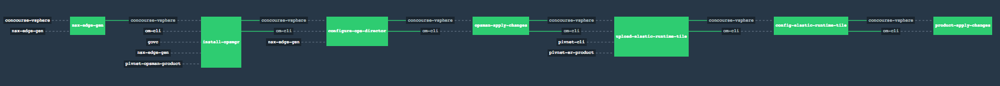

## Pipeline 'Environment Pre-Reqs'

- vSphere 6.x or greater functional environment
- NSX-V must be deployed and functional on one or more vSphere cluster(s)
- NSX-V must have the following constructs created:

	- Cluster(s) must have VXLAN(vTEPS) prepared & functional 
	- A NSX Transport Zone must exist
- vSphere environment must have at least **1** of the following ***[Standard PortGroup|Distributed PortGroup|Logical Switch]*** for an `uplink` port group.  
   - This port group must have a network that is routable in the environment.  This is the `uplink` network
- vSphere Environment must have **5** routable ip addresses on the `uplink` network for NSX Edge Load Balancer VIPs & NAT configuration.
    - NSX Edge Primary Uplink Interface IP (Default SNAT)
    - DNAT _VIP-Opsman_
    - Load Balancer _VIP-ERT_ (Go Routers)
    - Load Balancer _VIP-SSH-Proxy_ (Diego Brains)
    - Load Balancer _VIP-TCP-ROUTER(s)_
- DNS must resolve mapped to the following VIPs
    - **opsman.[your.system.cf.domain]** -> _VIP-Opsman_
    - ***.[your.system.cf.domain]** -> _VIP-ERT_
    - ***.[your.default-apps.cf.domain]** -> _VIP-ERT_
    - **ssh.[your.system.cf.domain]** -> _VIP-SSH-PROXY_
- All desired vSphere Datacenter,Cluster,& Resource Pool objects must exist.  The pipeline will not create them
- vCenter Account must have proper permissions.


Video Link(s)

- PCF-NSX Demo (March 20, 2017): [stream-video](http://pcf-bt-vmware.s3-us-west-2.amazonaws.com/btvid.html) or [download-video](http://pcf-bt-vmware.s3-us-west-2.amazonaws.com/pcf-nsx-demo.mp4) (800MB | 24:44)


## Running the Pipeline

1. Clone this repo: `git clone https://github.com/cf-platform-eng/nsx-ci-pipeline.git`
2. Change into the resultant directory: `cd nsx-ci-pipeline`
3. Create a directory for you Concourse parameters|configuration file: `mkdir params`
4. Past parameters the sample below into a new file,  ***change the required min variables!!!*** : `vi params/env1-params.yml`


**To use this pipeline create the env1-params.yml file with the following sample.  Replace all variables commented as `REQUIRED`!!!**

```
#########################
## ERT & Opsman config ##
#########################
---
# Core Concourse Resource Params
pivnet_token: <YOUR PIVNET TOKEN> #REQUIRED
github_user: <YOUR GITHIB USERID> #REQUIRED
github_token: <YOUR GITHIB TOKEN> #REQUIRED

## vCenter Params
vcenter_host: <YOUR VCENTER URL|IP> #REQUIRED
vcenter_usr: administrator@vsphere.local #REQUIRED
vcenter_pwd: <YOUR VCENTER ADMIN PASSWD> #REQUIRED
vcenter_data_center: Datacenter #REQUIRED

## NSX Integration Params
nsx_edge_gen_nsx_manager_address: <YOUR NSX MANAGER URL|IP> #REQUIRED
nsx_edge_gen_nsx_manager_admin_user: admin #REQUIRED
nsx_edge_gen_nsx_manager_admin_passwd: <YOUR NSX MANAGER PASSWORD> #REQUIRED
nsx_edge_gen_nsx_manager_transport_zone: <YOUR NSX TRANSPORT ZONE> #REQUIRED
nsx_edge_gen_nsx_manager_distributed_port_switch: <YOUR NSX DISTRIBUTED PORTSWITCH> #REQUIRED
nsx_edge_gen_egde_datastore: <YOUR DATASTORE FOR NSX EDGES> #REQUIRED example: vsanDatastore
nsx_edge_gen_egde_cluster: <YOUR CLUSTER FOR NSX EDGES> #REQUIRED example: Cluster1
nsx_edge_gen_name: nsx-pipeline-sample #string name for NSX objects
esg_size: compact
esg_ospf_password_1: P1v0t4l!
esg_cli_username_1: admin 
esg_cli_password_1: P1v0t4l!P1v0t4l!
esg_certs_name_1: nsx-gen-created
esg_default_uplink_pg_1: "<YOUR NSX-EDGE-UPLINK PORT GROUP>" #REQUIRED "VM Network"
esg_default_uplink_ip_1: <YOUR NSX-EDGE-PRIMARY-VIP> #REQUIRED example: 10.172.16.100
esg_opsmgr_uplink_ip_1: <YOUR OPSMAN-VIP> #REQUIRED example: 10.172.16.101
esg_go_router_uplink_ip_1: <YOUR ERT-VIP> #REQUIRED example: 10.172.16.102
esg_diego_brain_uplink_ip_1: <YOUR SSH-PROXY-VIP> #REQUIRED example: 10.172.16.103
esg_tcp_router_uplink_ip_1: <YOUR TCP-ROUTER-VIP> #REQUIRED example: 10.172.16.104
esg_gateway_1: <YOUR ROUTED-UPLINK-NETWORK GATEWAY> #REQUIRED example: 10.172.16.1

## NSX Integration Isolation Segment Params
isozone_switch_name_1: IsoZone-1
isozone_switch_cidr_1: 192.168.32.0/22
esg_go_router_isozone_1_uplink_ip_1: <YOUR ISO1-VIP> #REQUIRED example: 10.172.16.105
esg_go_router_isozone_1_inst_1: 2 # Number of go-routers for IsoZone1
esg_tcp_router_isozone_1_uplink_ip_1: <YOUR TCP-ROUTER_ISO1-VIP> #REQUIRED example: 10.172.16.105
esg_tcp_router_isozone_1_inst_1: 2 # Number of tcp-routers for IsoZone1

#### Opsman configuration
## Ops Manager installation meta data
om_data_store: vsanDatastore #REQUIRED
om_host: <YOUR FQDN DNS FOR OPSMAN VIP> #REQUIRED example: opsman.domain.local
om_usr: admin
om_pwd: P1v0t4l!
om_ssh_pwd: P1v0t4l!
om_decryption_pwd: P1v0t4l!
om_ntp_servers: <YOUR ENVIRONMENTS NTP> #REQUIRED example: 10.193.99.2
om_dns_servers: <YOUR ENVIRONMENTS DNS> #REQUIRED example: 10.193.99.2
om_gateway: 192.168.10.1
om_netmask: 255.255.255.0
om_ip: 192.168.10.5

om_vm_network: nsxgen
om_vm_name: opsman-nsx-pipeline
om_resource_pool: <YOUR TARGET RESPOOL FOR OPSMAN> #REQUIRED example: respool-opsman

disk_type: thin
om_vm_power_state: true

storage_names: <YOUR TARGET DATASTORE(S) FOR PCF> #REQUIRED example: vsanDatastore,vsanDatastore2,vsanDatastore3

## AZ configuration for Ops Director, as configured requires 3 vSphere cluster|respools
az_1_name: az1
az_2_name: az2
az_3_name: az3
az_singleton: az1
az_ert_singleton: az1
azs_ert: az1,az2,az3

az_1_cluster_name: <YOUR AZ1 CLUSTER> #REQUIRED example: Cluster1
az_2_cluster_name: <YOUR AZ2 CLUSTER> #REQUIRED example: Cluster2
az_3_cluster_name: <YOUR AZ3 CLUSTER> #REQUIRED example: Cluster3

az_1_rp_name: <YOUR AZ1 RESPOOL> #REQUIRED example: cc-pipeline-rp1
az_2_rp_name: <YOUR AZ1 RESPOOL> #REQUIRED example: cc-pipeline-rp2
az_3_rp_name: <YOUR AZ1 RESPOOL> #REQUIRED example: cc-pipeline-rp3

ntp_servers: <YOUR ENVIRONMENTS NTP> #REQUIRED example: 10.193.99.2
ops_dir_hostname:

## Network configuration for Ops Director
infra_network_name: "INFRASTRUCTURE"
infra_vsphere_network: nsxgen
infra_nw_cidr: 192.168.10.0/26
infra_excluded_range: 192.168.10.1-192.168.10.9,192.168.10.60-192.168.10.61
infra_nw_dns: <YOUR INFRA NET DNS> #REQUIRED
infra_nw_gateway: 192.168.10.1
infra_nw_az: az1,az2,az3

deployment_network_name: "ERT"
deployment_vsphere_network: nsxgen
deployment_nw_cidr: 192.168.20.0/22
deployment_excluded_range: 192.168.20.1-192.168.20.9,192.168.23.250-192.168.23.253
deployment_nw_dns: <YOUR ERT NET DNS> #REQUIRED
deployment_nw_gateway: 192.168.20.1
deployment_nw_az: az1,az2,az3

services_network_name: "PCF-TILES"
services_vsphere_network: nsxgen
services_nw_cidr: 192.168.24.0/22
services_excluded_range: 192.168.24.1-192.168.24.9,192.168.27.250-192.168.27.253
services_nw_dns: <YOUR PCF TILES NET DNS> #REQUIRED
services_nw_gateway: 192.168.24.1
services_nw_az: az1,az2,az3

dynamic_services_network_name: "PCF-DYNAMIC-SERVICES"
dynamic_services_vsphere_network: nsxgen
dynamic_services_nw_cidr: 192.168.28.0/22
dynamic_services_excluded_range: 192.168.28.1-192.168.28.9,192.168.31.250-192.168.31.253
dynamic_services_nw_dns: <YOUR PCF DYN-SERVCIES NET DNS> #REQUIRED
dynamic_services_nw_gateway: 192.168.28.1
dynamic_services_nw_az: az1,az2,az3

isozone_switch_1_network_name: "ISOZONE-1"
isozone_switch_1_vsphere_network: nxsgen
isozone_switch_1_excluded_range: 192.168.32.1-192.168.32.9,192.168.32.250-192.168.32.253
isozone_switch_1_nw_dns: <YOUR PCF DYN-SERVCIES NET DNS> #REQUIRED
isozone_switch_1_nw_gateway: 192.168.32.1
isozone_switch_1_nw_az: az1,az2,az3

loggregator_endpoint_port: 443

#### ERT configuration
## ERT Syslog endpoint configuration goes here
syslog_host:
syslog_port:
syslog_protocol:

network_point_of_entry: external_non_ssl

## ERT Wildcard domain certs go here
ssl_cert:
ssl_private_key:

disable_http_proxy: true

## ERT TCP routing and routing services
tcp_routing: enable
tcp_routing_ports: 5000
route_services: enable
ignore_ssl_cert_verification: true

## ERT SMTP configuration goes here
smtp_from:
smtp_address:
smtp_port:
smtp_user:
smtp_pwd:
smtp_auth_mechanism:

## ERT Auth Config method
uaa_method: internal

## ERT LDAP Configuration goes here
ldap_url:
ldap_user:
ldap_pwd:
search_base:
search_filter:
group_search_base:
group_search_filter:
mail_attribute_name:
first_name_attribute:
last_name_attribute:

## ERT Deployment domain names
system_domain: <YOUR WILDCARD DNS MAPPED TO ERT VIP FOR SYSTEM URL> #REQUIRED example: sys.domain.local
apps_domain: <YOUR WILDCARD DNS MAPPED TO ERT VIP FOR DEFAULT APPS URL> #REQUIRED example: apps.domain.local

skip_cert_verify: true

## ERT Static IP's for the following jobs
ha_proxy_ips:
router_static_ips: 192.168.20.10,192.168.20.11,192.168.20.12,192.168.20.13
tcp_router_static_ips: 192.168.20.30,192.168.20.31,192.168.20.32,192.168.20.33
ssh_static_ips: 192.168.20.20,192.168.20.21,192.168.20.22
ert_mysql_static_ips: 192.168.20.41,192.168.20.42,192.168.20.43

## ERT Target email address to receive mysql monitor notifications
mysql_monitor_email: <SMTP FOR MYSQL ALERTS> #REQUIRED example: mglynn@pivotal.io

## ERT Default resource configuration
consul_server_instances: 1
nats_instances: 1
etcd_tls_server_instances: 1
nfs_server_instances: 1
mysql_proxy_instances: 1
mysql_instances: 1
backup_prepare_instances: 0
ccdb_instances: 0
uaadb_instances: 0
uaa_instances: 1
cloud_controller_instances: 1
ha_proxy_instances: 0
router_instances: 1
mysql_monitor_instances: 1
clock_global_instances: 1
cloud_controller_worker_instances: 1
diego_database_instances: 1
diego_brain_instances: 1
diego_cell_instances: 3
doppler_instances: 1
loggregator_traffic_controller_instances: 1
tcp_router_instances: 1

##################
## MYSQL config ##
##################
tile_az_mysql_singleton: az1
tile_azs_mysql: az1,az2,az3
tile_mysql_proxy_ips: 192.168.24.10,192.168.24.11,192.168.24.12
tile_mysql_proxy_vip: 172.16.100.20 #Default 
tile_mysql_monitor_email: <SMTP FOR MYSQL ALERTS> #REQUIRED example: mglynn@pivotal.io

###################
## Rabbit config ##
###################
tile_az_rabbit_singleton: az1
tile_azs_rabbit: az1,az2,az3
tile_rabbit_proxy_ips: 192.168.24.30,192.168.24.31,192.168.24.32
tile_rabbit_proxy_vip: 172.16.100.30 #Default 
tile_rabbit_admin_user: rabbitadmin
tile_rabbit_admin_passwd: rabbitadmin

###################
## SCS config ##
###################
tile_az_scs_singleton: az1
tile_azs_scs: az1,az2,az3


```

5. Now you can execute the following commands:

 -	`fly -t lite login`
 -  `fly -t lite set-pipeline -p pcf -c pipelines/new-setup-with-nsx-edge-gen/pipeline.yml -l params/env1-params.yml`
 -	`fly -t lite unpause-pipeline -p pcf`



